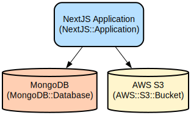

# Next.js Authentication Template: Secure User Management with MongoDB Integration

A modern, type-safe authentication system built with Next.js 14, MongoDB, and NextAuth.js. This template provides a complete authentication solution with email verification, OTP support, and role-based access control, all wrapped in a responsive dashboard interface.

The template offers a comprehensive authentication flow with features like user registration, login, password reset, and email verification using OTP. It leverages Next.js's App Router for optimal performance and MongoDB for reliable data persistence. The UI is built with HeroUI components and Tailwind CSS, providing a clean and customizable interface with built-in dark mode support.

## Repository Structure
```
.
├── app/                      # Next.js application routes and pages
│   ├── api/                 # API routes for authentication and user management
│   ├── auth/               # Authentication-related pages (login, register, forgot-password)
│   └── dashboard/          # Protected dashboard routes and layouts
├── components/              # Reusable React components
│   ├── auth/              # Authentication-related components
│   ├── dashboard/         # Dashboard layout and sidebar components
│   └── ui/               # Common UI components
├── lib/                     # Utility functions and configurations
│   ├── server-actions/    # Server-side actions for auth and email
│   └── db.ts             # Database connection configuration
├── models/                  # MongoDB models for User and OTP
├── templates/              # Email templates for notifications
└── docs/                   # Infrastructure documentation
```

## Usage Instructions
### Prerequisites
- Node.js 18.x or later
- MongoDB instance (local or Atlas)
- AWS S3 bucket (for file storage)
- SMTP server credentials for email notifications

### Installation
```bash
# Clone the repository
git clone <repository-url>
cd nextjs-auth-template

# Install dependencies
npm install

# Set up environment variables
cp .env.example .env.local
```

Configure the following environment variables in `.env.local`:
```
DATABASE_URL=mongodb://localhost:27017/your-database
NEXTAUTH_SECRET=your-secret-key
NEXTAUTH_URL=http://localhost:3000
AWS_ACCESS_KEY_ID=your-aws-key
AWS_SECRET_ACCESS_KEY=your-aws-secret
```

### Quick Start
1. Start the development server:
```bash
npm run dev
```

2. Visit `http://localhost:3000` to access the application.

3. Register a new user account using the registration form.

### More Detailed Examples
#### User Registration Flow
```typescript
// Register a new user
const response = await fetch('/api/auth/register', {
  method: 'POST',
  body: JSON.stringify({
    email: 'user@example.com',
    password: 'securepassword',
    name: 'John Doe'
  })
});
```

#### Protected API Routes
```typescript
// Fetch user data (protected route)
const response = await fetch('/api/users/me', {
  headers: {
    'Authorization': `Bearer ${session.token}`
  }
});
```

### Troubleshooting
#### Common Issues
1. MongoDB Connection Errors
   ```
   Error: MongoServerSelectionError: connect ECONNREFUSED
   ```
   - Verify MongoDB is running
   - Check DATABASE_URL in .env.local
   - Ensure network connectivity

2. Email Verification Issues
   - Check SMTP configuration
   - Verify email template formatting
   - Check spam folder for verification emails

## Data Flow
The application follows a secure authentication flow with email verification and session management.

```ascii
User Request → Next.js App Router → API Routes → MongoDB
     ↑                  ↓              ↓           ↓
  Browser   ←    NextAuth.js    ←   Session   ←  Data
```

Key component interactions:
1. User submits registration/login request
2. NextAuth.js handles authentication flow
3. OTP verification sent via email when required
4. Session token generated and stored
5. Protected routes check session validity
6. MongoDB stores user data and OTP codes
7. AWS S3 handles file storage when needed

## Infrastructure


### AWS Resources
- S3 Bucket: Used for file storage and media uploads

### Database
- MongoDB: Primary database for user data and OTP storage
  - Collections:
    - users: Stores user profiles and credentials
    - otps: Manages OTP codes for email verification

### Application
- Next.js Application: Main web application
  - Connects to MongoDB for data persistence
  - Integrates with AWS S3 for file storage
  - Handles authentication and authorization